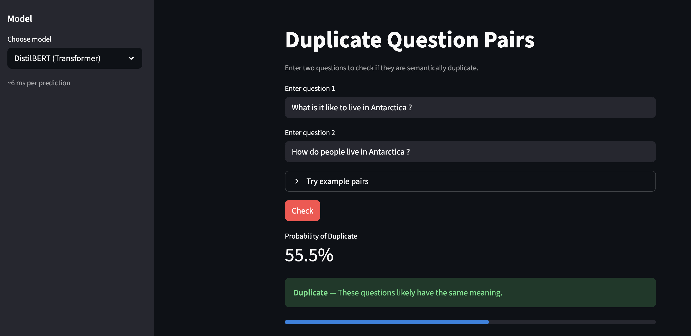
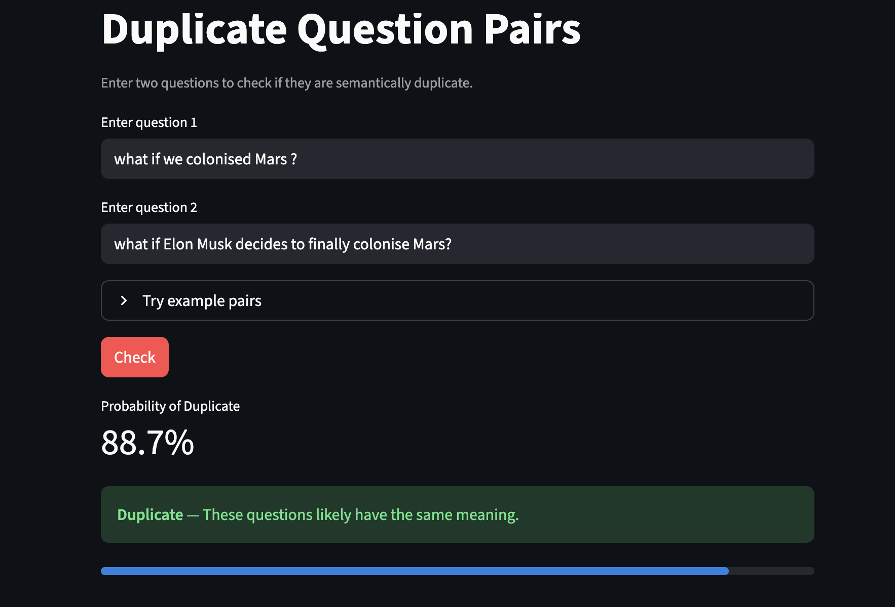
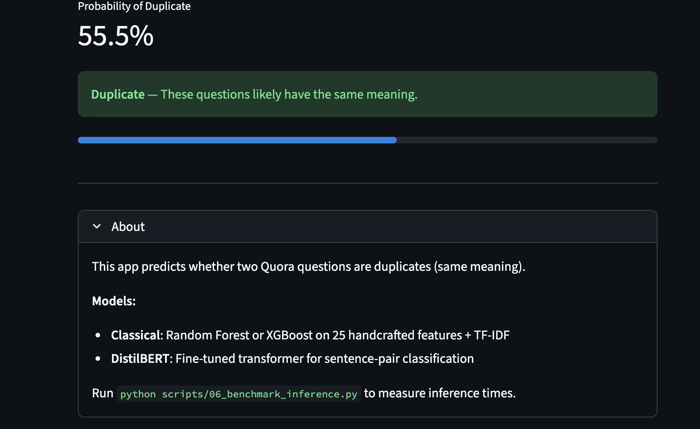
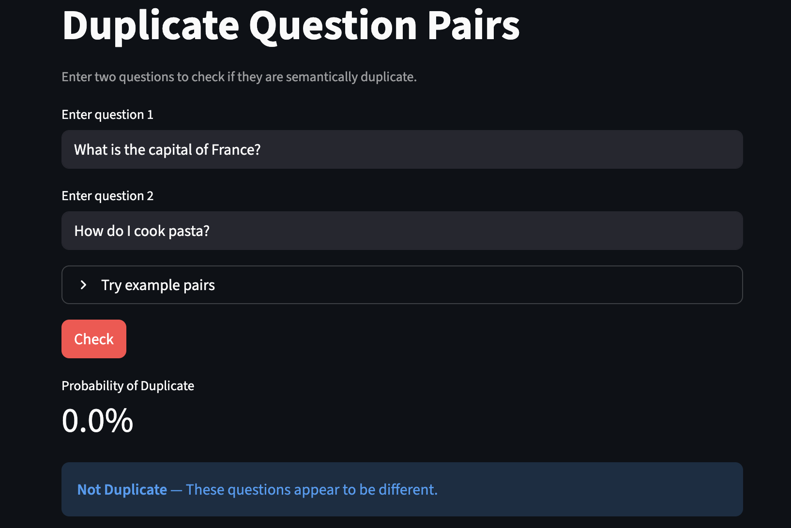

# Quora Duplicate Question Detector

A NLP project to detect whether two Quora questions are semantically duplicate — built for fun & learning.

**Dataset:** [Quora Question Pairs (Kaggle)](https://www.kaggle.com/c/quora-question-pairs)

---

## Screenshots

| | |
|---|---|
|  |  |
|  |  |

---

## Evaluation Results

Trained on **404K samples** from the Quora Question Pairs dataset.

| Model | Accuracy | F1 | Precision | Recall | AUC-ROC | Inference |
|-------|----------|-----|-----------|--------|---------|-----------|
| **Classical (RF)** | 86.2% | 81.5% | 80.5% | 82.5% | 93.8% | ~8.4 ms |
| **DistilBERT** | **89.5%** | **86.1%** | **84.0%** | **88.3%** | — | ~5.5 ms |

- **Classical:** Random Forest on 25 handcrafted features + TF-IDF + Sentence Transformer embeddings
- **DistilBERT:** Fine-tuned transformer for sentence-pair classification (3 epochs, full dataset)

---

## Quick Start

### Local setup

```bash
# Clone and install
git clone https://github.com/YOUR_USERNAME/quora-question-pairs.git
cd quora-question-pairs
pip install -r requirements.txt
pip install -r streamlit-app/requirements.txt

# Run the app (models must be in models/ or downloaded from HF Hub)
streamlit run streamlit-app/app.py
```

### Deployment (Hugging Face Spaces)

Models are hosted on the [Hugging Face Hub](https://huggingface.co). The app downloads them at startup. See deployment docs for setup.

---

## Project Structure

```
quora-question-pairs/
├── streamlit-app/     # Web app
├── scripts/           # Training & benchmarking
├── src/               # Shared modules
├── data/              # Dataset (add train.csv from Kaggle)
└── models/            # Model artifacts (download from HF Hub)
```

---

## Disclaimer

> **Note:** Results may not always be accurate. This is a learning project — use with caution and do not rely on it for critical decisions.

---

## Special Thanks

Special thanks to **[CampusX](https://www.youtube.com/@campusx-official)** (NLP Playlist) for inspiring this project.

---

## License

MIT
